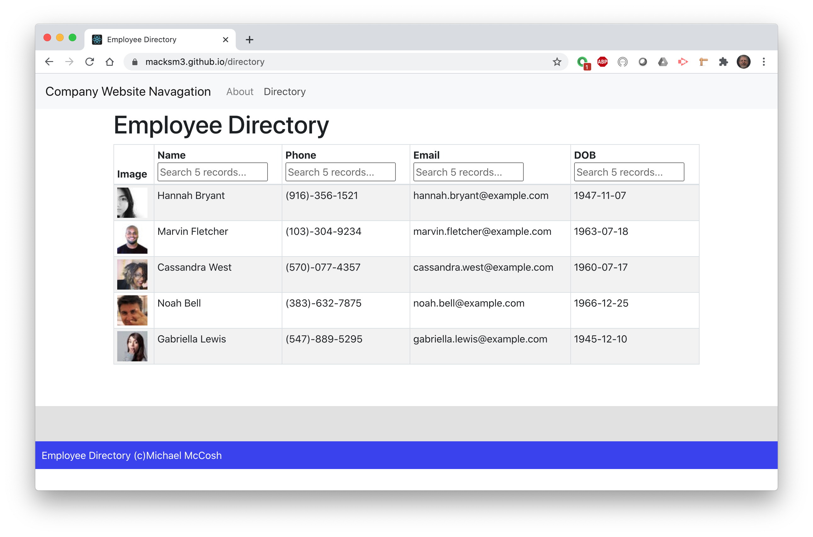

# employee-directory
employee directory with react unit 19
## Description
A sample company website with a directory page that contains a searchable/sortable employe directory. 

Github repo: https://github.com/macksm3/employee-directory

Deplyed app: https://macksm3.github.io/employee-directory

## Table of Contents 

* [Installation](#installation)
* [Usage](#usage)
* [Contributers](#contributers)
* [License](#license)

## Installation
This app resides on the github server and is accessed with a web browser.

## Usage
This app is a simple directory page, the list can be sorted by column and a search is available for each column. For table creation, the react-table module was chosen. one odd behavior noticed is that the sort function has 3 states, clicking the column heading cycles through sort assending, sort decending and sort off.

## License
MIT License

## Badges

